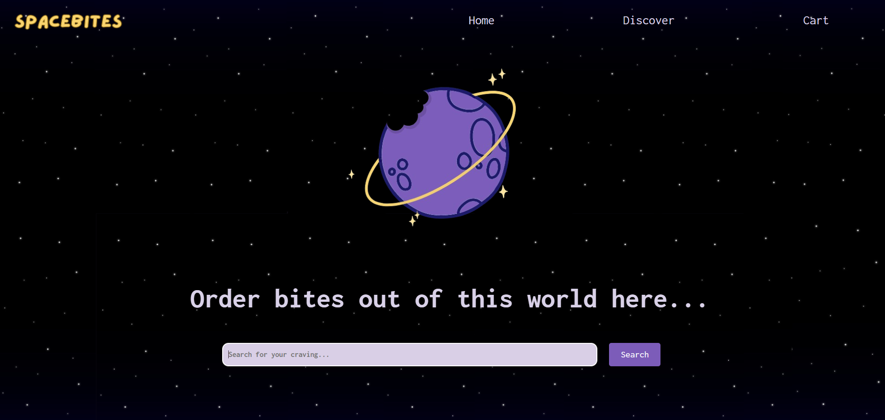

# SpaceBites
### WDCC x SESA 2024 Hackathon Project
#### Made with an awesome team of 6 :)



### Problem statement

After the Earth was lost to an earth-shattering explosion, human life must begin anew in the extraterrestrial realm. To reminisce about the fond memories of homely comforts, as well as connect with a foreign lifestyle, SpaceBites brings its users a selection of Earth-based, local, and interstellar dishes.

## Functions

- Search for restaurants
- Filter by dietary requirements
- Modify items in cart

(Currently, McGalaxy has a full menu list.)

## Usage

This project was made using React + Vite.

Clone the repository and install dependencies:

```sh
git clone <repository-url>
cd <repository-directory>
npm install
```

Install vite:

```sh
npm install vite --save-dev
```

Run vite:
```sh
npx vite
```

Run script:
```sh
npm run dev
```

View website on localhost.

## Future steps

- Implement backend logic to handle ordering
- Allow for more precise search queries (regarding food items rather than only the companies)
- Implement login feature and secure database for user info
- Add a page to enable collaboration requests from businesses

## Demo
https://github.com/user-attachments/assets/ca1225f4-389b-4590-8659-fe56fb9165c7
